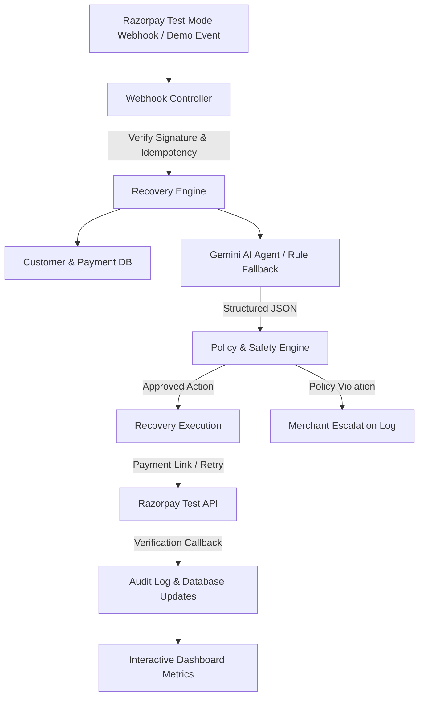

# RecoverAI – AI Revenue Recovery Agent
### Razorpay Buildathon Track 03: AI Revenue Recovery

> **"RecoverAI doesn't just identify lost revenue. It takes a bounded recovery action, verifies the result, knows when to stop, and measures the money it actually recovers."**

---

## 🚀 Overview

**RecoverAI** is an autonomous, bounded AI revenue recovery system built for merchants using Razorpay. When payments fail due to bank degradations, insufficient funds, OTP timeouts, or gateway errors, RecoverAI automatically detects revenue at risk, diagnoses customer & payment histories, decides on bounded interventions using Google Gemini, validates actions through a deterministic Policy Safety Engine, executes test-mode payment links or retries, and tracks real dynamic recovered capital.

---

## 📌 Core Workflow Model

```
DETECT → DIAGNOSE → DECIDE → VALIDATE → ACT → VERIFY → STOP → MEASURE
```

1. **DETECT**: Ingests failed payment webhooks from Razorpay or demo triggers.
2. **DIAGNOSE**: Retrieves customer payment history, failed transaction counts, and LTV.
3. **DECIDE**: Google Gemini AI Agent analyzes data and outputs structured JSON diagnostic recommendations.
4. **VALIDATE**: Policy Safety Engine enforces strict spending ceilings (₹50,000 max), retry limits (2 max), and confidence thresholds (≥ 50%).
5. **ACT**: Creates Razorpay Test Mode Payment Links, initiates retries, or dispatches reminders.
6. **VERIFY**: Listens for `payment_link.paid` or `payment.captured` webhooks to verify payment clearance.
7. **STOP**: Terminates recovery workflows when maximum limits are hit or safety rules trigger.
8. **MEASURE**: Dynamically calculates Revenue at Risk, Revenue Recovered, and Recovery Rate % from MongoDB.

---

## 🏗 System Architecture



---

## ✨ Features

- **Autonomous AI Diagnostics**: Leverages Google Gemini (`gemini-1.5-flash`) to diagnose payment failures.
- **Rule-Based Soft Fallback**: Fully functional fallback diagnostic engine ensures 100% uptime even if AI API keys are missing.
- **Deterministic Policy Engine**: Prevents AI hallucination or risky execution by enforcing strict safety thresholds.
- **Razorpay Test Mode Integration**: Full support for real Test Mode Payment Link generation and webhook signature verification using raw request bodies.
- **Interactive Sandbox Checkout**: Clickable sandbox page allowing manual simulation of payment approvals.
- **Dynamic SaaS Dashboard**: Dynamic metrics (Revenue At Risk, Revenue Recovered, Recovery Rate %) rendered via Recharts.
- **Batch Evaluation System**: Offline harness evaluating 500 labeled synthetic payment cases with CSV output export.

---

## 📦 Technology Stack

- **Frontend**: React 18, Vite, Tailwind CSS, Recharts, Lucide React, Axios, React Router.
- **Backend**: Node.js, Express.js, REST API, Razorpay Node.js SDK, `@google/generative-ai` SDK, JWT Auth, Helmet, CORS.
- **Database**: MongoDB (Mongoose).
- **Deployment**: Vercel (Frontend), Render (Backend), MongoDB Atlas (Database).

---

## 🛠 Local Setup Instructions

### Prerequisites
- Node.js (v18+)
- MongoDB running locally (`mongodb://localhost:27017/recoverai`) OR MongoDB Atlas URI.

### 1. Clone & Configure Backend
```bash
cd recover-ai/backend
npm install
```

Copy `.env.example` to `.env` in `recover-ai/backend`:
```env
PORT=5000
MONGODB_URI=mongodb://localhost:27017/recoverai
JWT_SECRET=supersecretjwttokenkey12345!

# AI Configuration (Optional: system falls back to rule-based engine if key is missing)
GEMINI_API_KEY=your_gemini_api_key_here
AI_PROVIDER=MOCK

# Razorpay Test Mode Credentials
RAZORPAY_KEY_ID=rzp_test_mockkeyid123
RAZORPAY_KEY_SECRET=mockkeysecret123
RAZORPAY_WEBHOOK_SECRET=mockwebhooksecret123
```

Start the backend server:
```bash
npm run dev
```

### 2. Configure & Start Frontend
In a new terminal:
```bash
cd recover-ai/frontend
npm install
npm run dev
```
Open `http://localhost:5173` in your browser.


---

## 🧪 Interactive Demo Instructions

1. Log in to the RecoverAI Dashboard at `http://localhost:5173`.
2. Locate the **Interactive Demo Scenarios** panel on the dashboard:
   - **Scenario 1 (₹2,499 Bank Failure)**: Generates a payment link. Click "Inspect" -> "Open Sandbox Checkout" -> Click "Authorize Payment (Success)" to watch Revenue Recovered increase dynamically!
   - **Scenario 2 (₹42,000 High Risk)**: Demonstrates automatic escalation to merchant ops.
   - **Scenario 3 (₹999 Auto-Retry)**: Demonstrates immediate automated retry resolution.
   - **Scenario 4 (₹10,000 Limit Reached)**: Demonstrates Safety Engine triggering the STOP rule.
3. Visit `/evaluation` to view batch evaluation benchmark metrics over 500 test cases.

---

## 📊 Batch Evaluation Results

To run the offline batch evaluation benchmark manually:
```bash
cd recover-ai/backend
npm run evaluate
```
Outputs:
- `data/sample-payments.csv`: Detailed case predictions vs ground truth labels.
- `data/evaluation-results.csv`: Benchmark metrics summary.

---

## 📄 License

MIT License. Built for the Razorpay Buildathon 2026.
