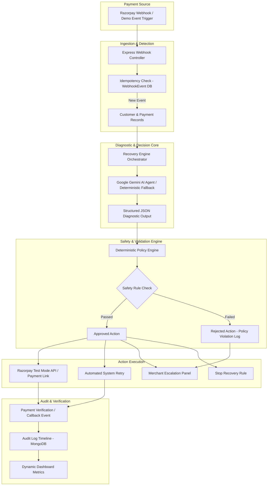

# System Architecture - RecoverAI Revenue Recovery Agent

RecoverAI is an autonomous, bounded AI revenue recovery system engineered for the Razorpay Buildathon. It automatically detects revenue at risk, diagnoses payment failure root causes, recommends interventions using an LLM API (Google Gemini), validates recommendations via a deterministic Policy Safety Engine, executes bounded recovery actions, and measures dynamic recovered capital.

---

## High-Level Architecture Diagram

---

## Architectural Principles

1. **Autonomous Bounded Execution**: The AI Agent makes diagnostic recommendations, but is strictly prohibited from executing code directly. A separate deterministic Policy Engine enforces business safety boundaries.
2. **Idempotency & Reliability**: Webhook handlers inspect Razorpay Event IDs to prevent double processing of identical payment failure or success callbacks.
3. **Graceful Soft Degradation**: If the Gemini API key is missing or fails due to network degradation, the system seamlessly transitions to a deterministic rule-based fallback returning identical JSON output structures.
4. **Immutable Audit Trails**: Every state change, AI recommendation, policy check result, and payment link creation event is recorded to a chronological Audit Log.
5. **Dynamic Metric Calculation**: Revenue at Risk, Revenue Recovered, and Recovery Rate percentages are dynamically computed from MongoDB database records rather than hardcoded.
